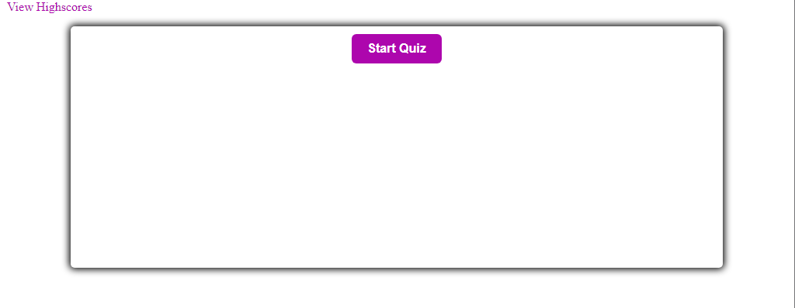
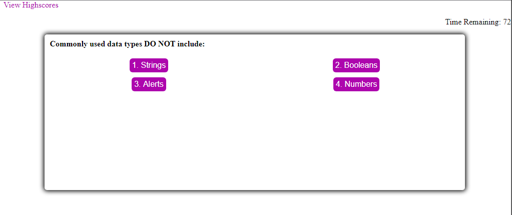
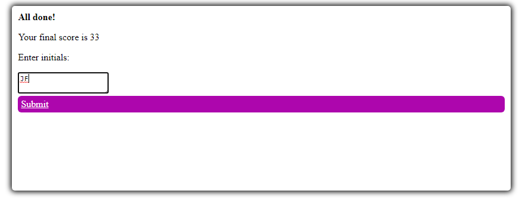
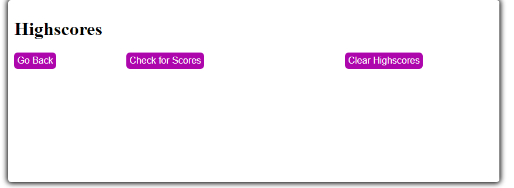
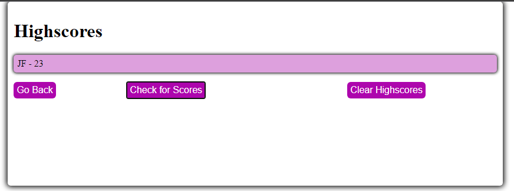
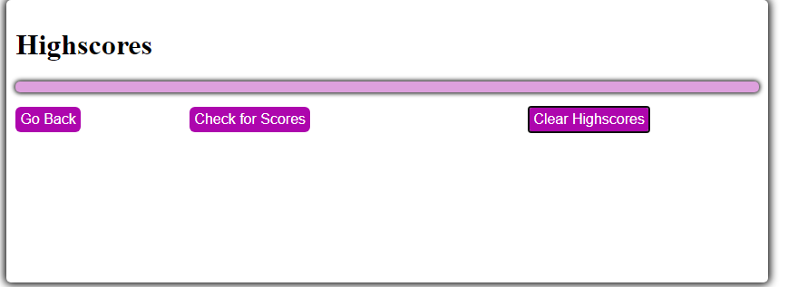
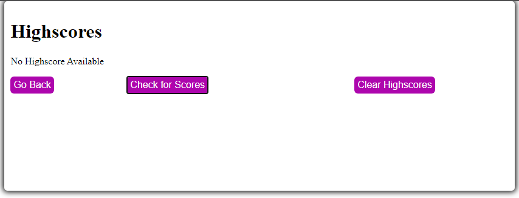

# Jack-s-Code-Quiz

## Purpose of this Project
This project was created for the purpose of creating a dynamic coding quiz - built using Javascript to manipulate the DOM and display the questions as well as keep track of time and highscores.
## Goals of this Project
The primary goal of this project was to create a Javascript-powered coding quiz, where the DOM was updated from the start screen, through the questions and to the game over screen - where the score would be displayed and the user could enter their initials to store a highscore in the local storage.
## Problems encountered in this Project
This has been by far the most frustrating project to work on and required many many revisions of existing code to get it working. As well as encountering many bugs, such as the timer refusing to stop once it hit 0. Retrieving the questions from the questions object and manipulating the DOM to display them took a bit of work and frustration. Along with a myriad of bugs that broke the project and made it unusable. Thankfully however, my instructor was very good in helping me get it working properly.

## Screenshots of Completed Project
###### Start Screen of the Quiz

###### Screenshot of Quiz with First Set of Questions loaded, with the Timer working in the top-right

###### Screenshot of the Finish Screen of the Quiz, where your Final Score is displayed and you enter your Intiials

###### Screenshot of Highscore Screen before any Highscores are Displayed

###### Screenshot of Highscore Screen with a Highscore Displayed

###### Screenshot of Highscore Screen after Clear Highscore is Used

###### Screenshot of Message when no Highscore is Available

## Links to GitHub Repository & Live Project
### https://github.com/Foggles/Jack-s-Code-Quiz
### https://foggles.github.io/Jack-s-Code-Quiz/